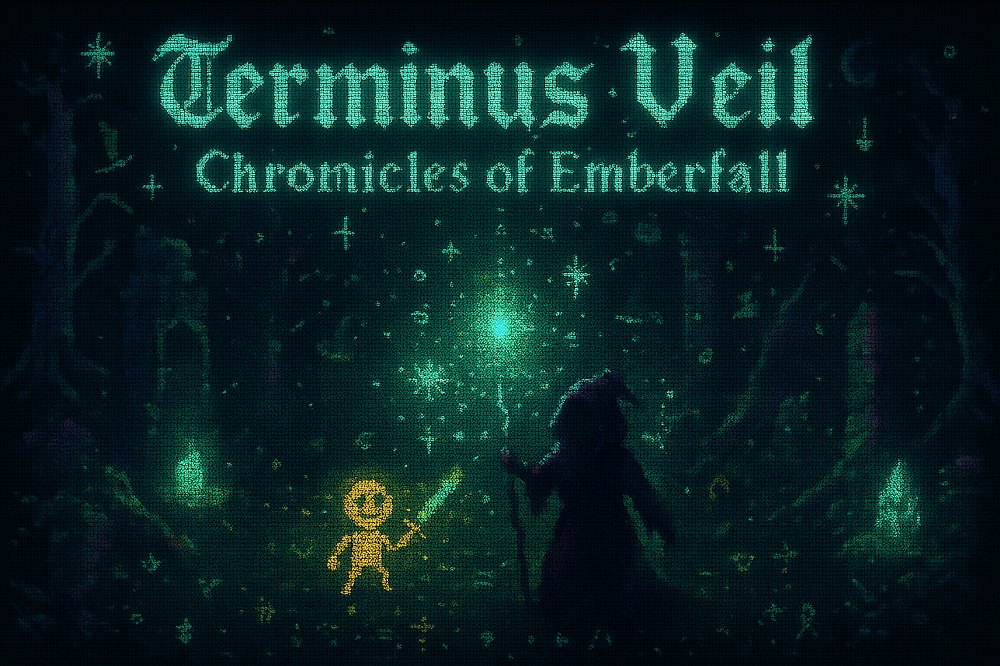
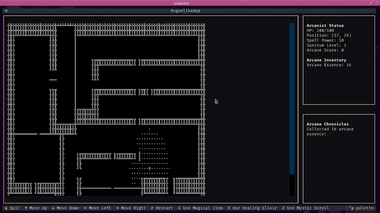

# Terminus Veil: Chronicles of Emberfall - A Magic Roguelike by Nullsec0x

You play as an Arcanist (wizard/mage) going into dungeons that are different every time. Fight monsters, pick up loot, and use your spells and mana smart to survive. Turn-based, tactical, old-school roguelike style, ASCII art everywhere.

## Gameplay

### Movement
- WASD or arrows to move or attack
- Dungeons are randomly generated using BSP, layouts change each run
- Field of view limited by walls, explored areas are remembered
- Deeper levels = stronger monsters, better loot

### Player
- Stats: Intelligence (spells stronger), Wisdom (healing + mana regen), Mana Pool (magic resource)
- HP starts at 100, heal with spells/items
- Inventory: potions, scrolls, other items you find

### Spells
| Spell | Mana Cost | Effect |
|-------|-----------|--------|
| Fireball | 20 MP | Damages nearest enemy |
| Heal | 15 MP | Restores 20–35 HP, scales with Wisdom |
| Teleport | 25 MP | Move to a safe spot instantly |
| Lightning Bolt | 30 MP | Hits a random enemy hard |

- Mana regenerates 1 MP per turn naturally, killing monsters restores some, potions +30 MP
- Spells are mapped to 1–4

### Combat
- Turn-based, choose to move, attack, or cast spells
- Staff attacks are weak, spells do more damage
- Monsters act on their turn according to AI
- Use spells strategically for damage, healing, or escaping

### Items
- Mana Potion: restores 30 MP
- Magic Scroll: random effect
- Other items scattered, pick them up if needed

### Levels
- Each level has an exit, go deeper to continue
- Deeper levels have more monsters, stronger monsters, better loot

## Visuals
- ASCII art for monsters, walls, spells
- Walls use line characters (╔╗╚╝║═╬)
- Colors differentiate player, monsters, items
- Magical effects like glowing runes, ley lines

## Controls
- WASD/Arrows: move/attack
- 1: Fireball
- 2: Heal
- 3: Teleport
- 4: Lightning Bolt
- 5: Mana Potion
- 6: Magic Scroll
- R: restart level
- Q: quit game

## Tips
- Manage mana, it regenerates slowly
- Use Teleport to escape dangerous situations
- Heal before you get too low
- Collect potions for long runs
- Intelligence makes spells stronger, Wisdom improves healing and mana efficiency
- Take advantage of walls and layout for strategy
- Combos: Fireball → Teleport, Heal between fights, Lightning Bolt for priority targets

## Tech
- Python 3.11+
- Textualize for terminal UI
- Modular, object-oriented code

Key files: main.py, game/player.py, game/game_map.py, game/dungeon_generator.py, game/monster.py, game/combat.py, game/items.py, game/fov.py, game/ascii_art.py, game/magic.py, game/spell_effects.py

## Lore
Magic has returned to Emberfall. As an Arcanist, you descend into dungeons to master spells and discover why magic has resurfaced.

## Summary
- Turn-based roguelike focused on magic
- Every run is different due to procedural generation
- Strategy, resource management, and tactical decisions are key
- ASCII visuals with magical atmosphere

## Demo

